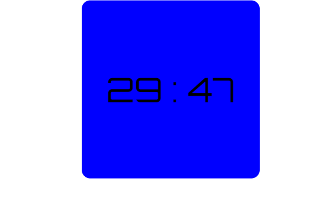

# contagem-regreciva-usando-ReactJS

<h4>Configurando</h4>

No seu arquivo index.html coloque os seguites links, eles são para importa as fontes usadas

        <link rel="preconnect" href="https://fonts.googleapis.com">
        <link rel="preconnect" href="https://fonts.gstatic.com" crossorigin>
        <link href="https://fonts.googleapis.com/css2?family=Orbitron:wght@400;500;600;700;800;900&family=Press+Start+2P&display=swap" rel="stylesheet">

<h4>Como usar<h4>

Na componente que deseja ter o cronometro, importe o cronometro e passe o tempo total em minutos

        import Cronometro3 from "./components/Cronometro3";

        export default function App() {
            return (
                

                    <Cronometro3 background="blue" color="black" fontSize="80px" width="400px" height="400px" tempoFinal={coloque o tempo todal em minutos} />
                

            );
        }

